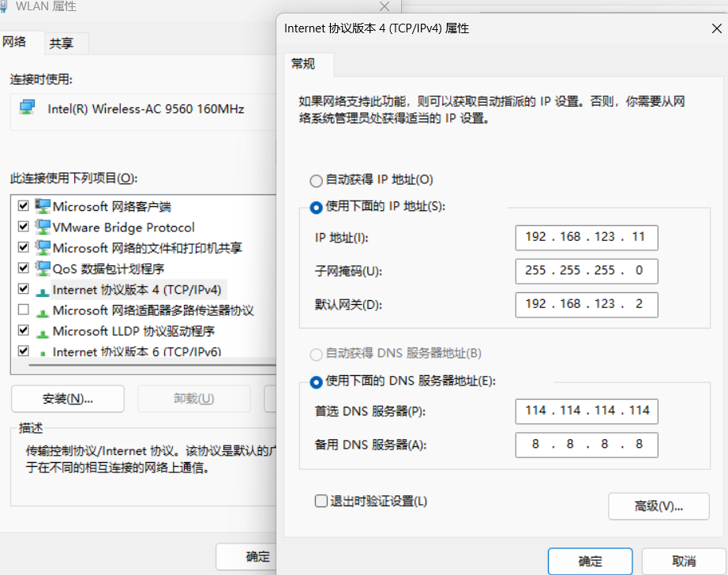
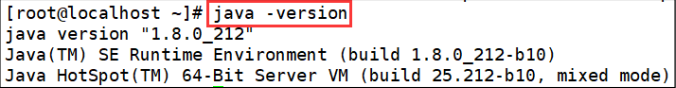
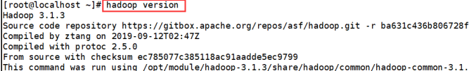

# `Hadoop`完全分布式搭建

## 1. 安装  `java`/`hadoop`

### 1.1 修改虚拟机网卡

`vim  /etc/sysconfig/network-scripts/ifcfg-ens33` 修改网卡配置文件

​				$\Downarrow$

````shell
BOOTPROTO="static"					#将IP设置为静态
#添加以下内容
#列
IPADDR=192.168.123.12		  #本机设置的IP
NETMASK=255.255.255.0		#子网掩码
GATEWAY=192.168.123.2		#网关
DNS1=114.114.114.114
DNS2=192.168.123.2
````

​				$\Downarrow$

`systemctl    restart   network` 重启网卡生效  （通过  `IP  a` 即可查看效果）

### 1.2 修改主机名及映射

`hostnamectl   set-hostname  (主机名)` $\Longrightarrow$  `bash`   $\Longrightarrow$ `vim /etc/hosts`   

​											$\Downarrow$  

````shell
192.168.123.12（主机IP地址） 		主机名
````

### 1.3  修改电脑网络适配器（正在使用的网卡）后连接xshell

右击选择属性，选择IPv4 ，双击进入修改如下  (IP  地址不唯一)

​							$\Downarrow$




### 1.4  配置  `jdk /hadoop` 环境变量

（通过`Xshell` 将所需安装包传输到Linux虚拟机）

`vim   /etc/profile`打开配置文件  $\Longrightarrow$  在末尾添加以下内容   

​									$\Downarrow$

````shell
export	JAVA_HOME=/opt/jdk..							 #java的安装目录
export	PATH=$JAVA_HOME/bin:$PATH

export	HADOOP_HOME=/opt/hadoop....				#hadoop的安装目录
export	PATH=$PATH:$HADOOP_HOME/bin:$HADOOP_HOME/sbin
````

​									$\Downarrow$

`source /etc/profile`  重新加载配置文件   $\Longrightarrow$  `java -version  `/`hadoop version` 查看效果

​									$\Downarrow$





## 2. 配置免密

### 2.1 通过 `ssh-keygen  -t  rsa`  生产密钥

==连续回车，直至结束。==

### 2.2 通过 `ssh-copy  hadoop101(主机名/IP)`

==复制密钥到需要免密登录的节点==

### 2.3 通过 `ssh hadoop101` 即可测试是否配置成功


## 3. 修改 `Hadoop` 配置文件

进入 `Hadoop` 安装目录下的 `/etc/hadoop` 目录

### 3.1 配置 `Hadoop-env.sh` 文件，如下：

```shell
export	JAVA_HOME=/opt/jdk..							 #java的安装目录
```

#### 3.2 配置 `yarn-env.sh` 文件，在末尾添加 `Java` 安装路径

````shell
export	JAVA_HOME=/opt/jdk..							 #java的安装目录
````

#### 3.3  配置 `mapre-env.sh`文件，在末尾添加 `Java` 安装路径

````shell
export	JAVA_HOME=/opt/jdk..							 #java的安装目录
````

### 3.2 配置 `core-site.xml` 文件

````shell
<configuration>
               #  <!--指定 NameNode 的地址 -->
                 <property>
                             <name>fs.defaultFS</name>
                             <value>hdfs://hadoop101:9000</value>
                 </property>
               #  <!-- 指定 hadoop 运行时产生数据的存储目录 -->
                 <property>
                             <name>hadoop.tmp.dir</name>
                             <value>/opt/module/hadoop-3.1.3/data/tmp</value>
                 </property>
</configuration>
````

### 3.3 配置 `hdfs-site.xml`文件

````shell
<configuration>
            #    <!-- 指定 HDFS 副本的数量 -->
                 <property>
                             <name>dfs.replication</name>
                             <value>1</value>
                 </property>
             #   <!-- namenode web 页面访问地址-->
                 <property>
                             <name>dfs.namenode.http-address</name>
                             <value>hadoop101:9870</value>
                 </property>
             #   <!-- secondarynamenode web 页面访问地址-->
                 <property>
                             <name>dfs.namenode.secondary.http-address</name>
                            <value>hadoop102:9868</value>
                 </property>
</configuration>
````

### 3.4 配置 `yarn-site.xml` 文件

```shell
<configuration>
                #<!-- 指定 mapreduce 采用 shuffle 机制 -->
                 <property>
                                 <name>yarn.nodemanager.aux-services</name>
                                 <value>mapreduce_shuffle</value>
                 </property>
                #<!-- 指定 ResourceManager 的地址-->
                 <property>
                                 <name>yarn.resourcemanager.hostname</name>
                                 <value>hadoop101</value>
                 </property>
</configuration>
```

### 3.5 配置 `mapred-site.xml` 文件

````shell
<configuration>
               #<!-- 指定 MapReduce 程序运行在 Yarn 上 -->
                 <property>
                                 <name>mapreduce.framework.name</name>
                                 <value>yarn</value>
                 </property>
 </configuration>
````

### 3.6 配置 `slaves`文件 

````shell
hadoop101
hadoop102
hadoop103
````

### 3.7 分发到配置文件到子节点

````shell
scp hadoop..../etc/hadoop  root@hadoop102:/hadoop.../etc/hadoop
scp hadoop..../etc/hadoop  root@hadoop103:/hadoop.../etc/hadoop
````

### 3.8 格式化文件系统 `Hadoop namenode -format `

出现 <mark> `successfully formatted`</mark> 即为成功

